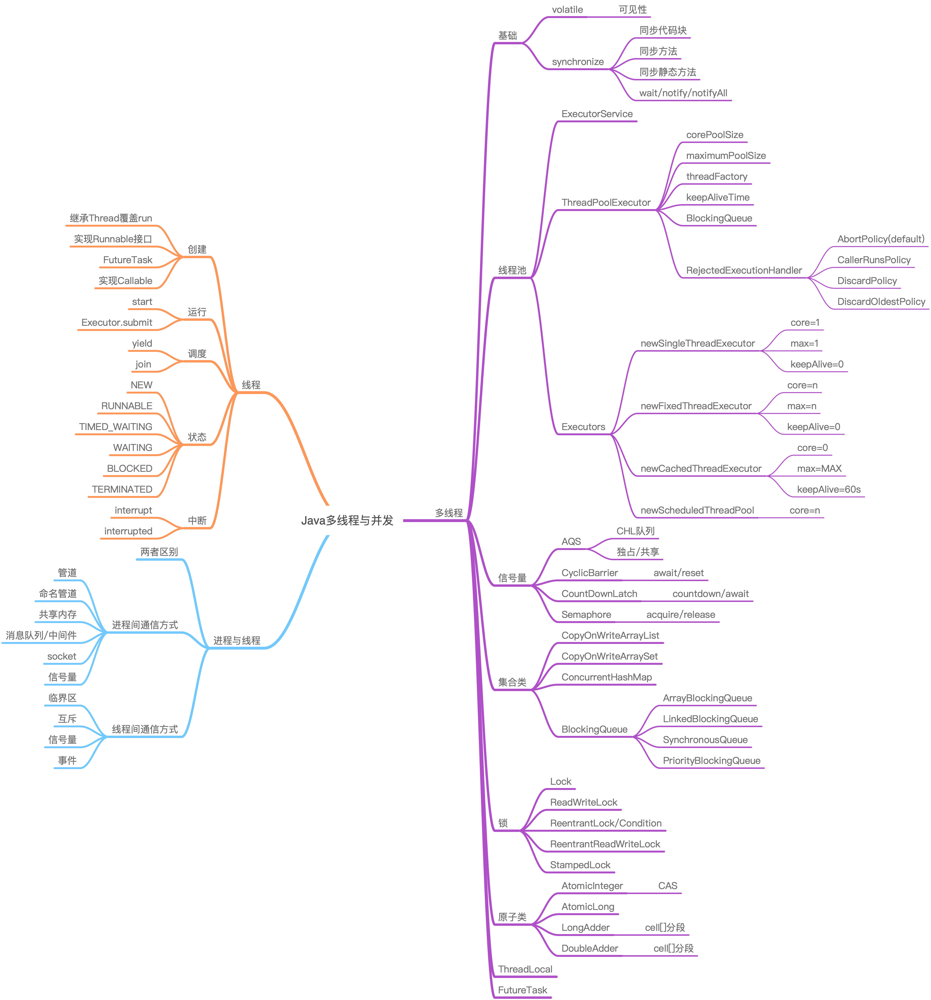

极客时间Java训练营第四周作业
=========================


#### 1. 把多线程和并发相关知识带你梳理一遍，画一个脑图，截图上传到github 上。
* volatile关键字
* synchronize关键字
* java.util.locks类
* 集合与线程安全
* 信号量CountdownLatch/CyclicBarrier/Semaphore
* 工具锁
* 原子类
* 线程池
* ThreadLocal变量
* Future与FutureTask




<a id="item2"></a>
#### 2. 思考有多少种方式，在main函数启动一个新线程，运行一个方法，拿到这个方法的返回值后，退出主线程？

1- 使用线程start+join [Solution1.java](./src/main/java/subthread/Solution1.java)
```java
public class Solution1 {
    public static void main(String[] args) {
        final int[] r = {1};

        final Thread thread = new Thread(new Runnable() {
            @Override
            public void run() {
                try {
                    Thread.sleep(2000);
                    r[0] += 5;
                } catch (InterruptedException e) {
                    e.printStackTrace();
                }
            }
        });

        thread.start();
        log.info("main thread waiting for result...");
        try {
            thread.join();
            log.info("sum result r = {}", r[0]);
        } catch (InterruptedException e) {
            e.printStackTrace();
        }
    }
}

```
2- 使用volatile + loop [Solution2.java](./src/main/java/subthread/Solution2.java)
```java
public class Solution2 {
    private static volatile boolean calculated = false;

    public static void main(String[] args) {
        final int[] r = {1};
        final Thread thread = new Thread(new Runnable() {
            @Override
            public void run() {
                try {
                    Thread.sleep(2000);
                    r[0] += 5;
                    calculated = true;
                } catch (InterruptedException e) {
                    e.printStackTrace();
                }
            }
        });
        thread.start();

        log.info("main thread waiting for result...");
        while (!calculated) {
            try {
                Thread.sleep(50);
            } catch (InterruptedException e) {
                e.printStackTrace();
            }
        }
        log.info("sum result r = {}", r[0]);
    }
}

```
3- 使用synchronized(lock) [Solution3.java](./src/main/java/subthread/Solution3.java)
```java
public class Solution3 {
    public static void main(String[] args) {
        final Object lock = new Object();
        final int[] r = {1};

        final Thread thread = new Thread(new Runnable() {
            @Override
            public void run() {
                synchronized (lock) {
                    try {
                        Thread.sleep(2000);
                        r[0] += 5;
                    } catch (InterruptedException e) {
                        e.printStackTrace();
                    }
                }
            }
        });

        thread.start();
        log.info("main thread waiting for result...");

        synchronized (lock) {
            log.info("sum result r = {}", r[0]);
        }
    }
}

```
4- 使用CountDownLatch [Solution4.java](./src/main/java/subthread/Solution4.java)
```java
public class Solution4 {
    public static void main(String[] args) {
        final CountDownLatch latch = new CountDownLatch(1);

        final int[] r = {1};
        final Thread thread = new Thread(new Runnable() {
            @Override
            public void run() {
                try {
                    Thread.sleep(2000);
                    r[0] += 5;
                } catch (InterruptedException e) {
                    e.printStackTrace();
                } finally {
                    latch.countDown();
                }
            }
        });

        thread.start();
        log.info("main thread waiting for result...");
        try {
            latch.await();
            log.info("sum result r = {}", r[0]);
        } catch (InterruptedException e) {
            e.printStackTrace();
        }
    }
}

```
5- 使用CyclicBarrier [Solution5.java](./src/main/java/subthread/Solution5.java)
```java
public class Solution5 {
    public static void main(String[] args) {
        final int[] r = {1};

        final CyclicBarrier barrier = new CyclicBarrier(1, new Runnable() {
            @Override
            public void run() {
                log.info("sum result r = {}", r[0]);
            }
        });

        final Thread thread = new Thread(new Runnable() {
            @Override
            public void run() {
                try {
                    Thread.sleep(2000);
                    r[0] += 5;
                    barrier.await();
                } catch (InterruptedException | BrokenBarrierException e) {
                    e.printStackTrace();
                }
            }
        });
        thread.start();
        log.info("main thread waiting for result...");
    }
}

```
6- 使用Semaphore信号量 [Solution6.java](./src/main/java/subthread/Solution6.java)
```java
public class Solution6 {
    public static void main(String[] args) {
        final Semaphore semaphore = new Semaphore(1);
        final int[] r = {1};

        final Thread thread = new Thread(new Runnable() {
            @Override
            public void run() {
                try {
                    semaphore.acquire();
                    Thread.sleep(2000);
                    r[0] += 5;
                } catch (InterruptedException e) {
                    e.printStackTrace();
                } finally {
                    semaphore.release();
                }
            }
        });

        thread.start();
        log.info("main thread waiting for result...");
        try {
            Thread.sleep(1);
            semaphore.acquire();
            log.info("sum result r = {}", r[0]);
        } catch (InterruptedException e) {
            e.printStackTrace();
        } finally {
            semaphore.release();
        }
    }
}
```
7- 使用BlockingQueue/BlockingDeque等待或传递结果 [Solution7.java](./src/main/java/subthread/Solution7.java)
```java
public class Solution7 {
    public static void main(String[] args) {
//        final BlockingQueue<Integer> queue = new ArrayBlockingQueue<>(1);
//        final BlockingQueue<Integer> queue = new LinkedBlockingQueue<>(1);
//        final BlockingQueue<Integer> queue = new LinkedBlockingDeque<>(1);
//        final BlockingQueue<Integer> queue = new LinkedTransferQueue<>();
//        final BlockingQueue<Integer> queue = new PriorityBlockingQueue<>();
        final BlockingQueue<Integer> queue = new SynchronousQueue<>();
        final int[] r = {1};

        final Thread thread = new Thread(new Runnable() {
            @Override
            public void run() {
                try {
                    Thread.sleep(2000);
                    r[0] += 5;
                    queue.put(r[0]);
                } catch (InterruptedException e) {
                    e.printStackTrace();
                }
            }
        });

        thread.start();
        log.info("main thread waiting for result...");
        try {
            queue.take();
            log.info("sum result r = {}", r[0]);
        } catch (InterruptedException e) {
            e.printStackTrace();
        }
    }
}
```
8- 使用ExecutorService + FutureTask.get [Solution8.java](./src/main/java/subthread/Solution8.java)
```java
public class Solution8 {
    public static void main(String[] args) {
        final ExecutorService executor = Executors.newSingleThreadExecutor();
        final int[] r = {1};

        final FutureTask<Integer> task = new FutureTask<Integer>(new Callable<Integer>() {
            @Override
            public Integer call() throws Exception {
                Thread.sleep(2000);
                r[0] += 5;
                return r[0];
            }
        });

        executor.submit(task);

        log.info("main thread waiting for result...");
        try {
            task.get();
            log.info("sum result r = {}", r[0]);
        } catch (InterruptedException | ExecutionException e) {
            e.printStackTrace();
        }
        // necessary to exit from main thread
        executor.shutdown();
    }
}
```
9- 通过ThreadGroup.activeCount()<=2来判定 [Solution9.java](./src/main/java/subthread/Solution9.java)
```java
public class Solution9 {
    public static void main(String[] args) {
        final int[] r = {1};

        final Thread thread = new Thread(new Runnable() {
            @Override
            public void run() {
                try {
                    Thread.sleep(2000);
                    r[0] += 5;
                } catch (InterruptedException e) {
                    e.printStackTrace();
                }
            }
        });
        thread.start();

        log.info("main thread waiting for result...");
        while (Thread.currentThread().getThreadGroup().activeCount() > 2) {
            try {
                Thread.sleep(1000);
            } catch (InterruptedException e) {
                e.printStackTrace();
            }
        }
        log.info("sum result r = {}", r[0]);
    }
}

```
10- 使用ServerSocket/Socket方式确认计算完成 [Solution10.java](./src/main/java/subthread/Solution10.java)
```java
public class Solution10 {
    public static void main(String[] args) {
        final int[] r = {1};

        final Thread thread = new Thread(new Runnable() {
            @Override
            public void run() {
                try {
                    Thread.sleep(2000);
                    r[0] += 5;
                    final Socket socket = new Socket();
                    socket.connect(new InetSocketAddress(9000));
                } catch (InterruptedException | IOException e) {
                    e.printStackTrace();
                }
            }
        });

        thread.start();

        log.info("main thread waiting for result...");
        try {
            final ServerSocket serverSocket = new ServerSocket(9000);
            try(final Socket socket = serverSocket.accept()) {
                log.info("sum result r = {}", r[0]);
            }
        } catch (IOException e) {
            e.printStackTrace();
        }
    }
}


```

总结，主要目的是主线程需要被block，子线程需要有条件触发主线程解除block的信号(如方法9除外)。通常情况下，
前几种方式是较为正式和常用的实现。
