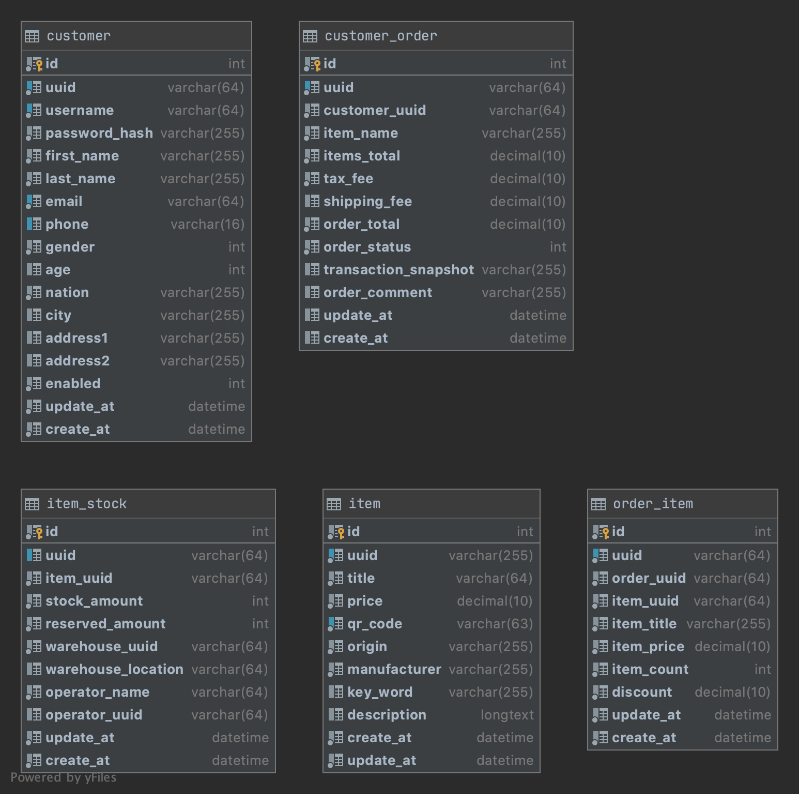

极客时间Java训练营第六周作业
=========================


#### 1. 基于电商交易场景（用户、商品、订单），设计一套简单的表结构，提交DDL的SQL文件到Github。

主要实体类如下图所示：


1-实体类表
* 用户表`customer`: 用户基本信息，交付地址，支付信息 [01-customer.sql](src/main/resources/01-customer.sql)
```sql
create table customer
(
	id int auto_increment comment '实例id'
		primary key,
	uuid varchar(64) not null comment '客户uuid',
	username varchar(64) not null comment '客户登录用户名',
	password_hash varchar(255) not null comment '用户登录密码',
	first_name varchar(255) not null comment '客户 名',
	last_name varchar(255) not null comment '客户 姓',
	email varchar(64) not null comment '用户邮箱',
	phone varchar(16) null comment '用户手机号',
	gender int default 0 not null comment '客户性别
0 - 男
1 - 女',
	age int null comment '客户年龄',
	nation varchar(255) default '中国' not null comment '客户所在国家',
	city varchar(255) null comment '城市',
	address1 varchar(255) null comment '地址栏1',
	address2 varchar(255) null comment '地址栏2',
	enabled int default 1 not null comment '客户状态
0 - 未启用
1 - 启用',
	update_at datetime default CURRENT_TIMESTAMP not null comment '更新时间',
	create_at datetime default CURRENT_TIMESTAMP not null comment '创建时间',
	constraint customer_email_uindex
		unique (email),
	constraint customer_phone_uindex
		unique (phone),
	constraint customer_username_uindex
		unique (username),
	constraint customer_uuid_uindex
		unique (uuid)
)
comment '客户信息表';
```
* 商品表`item`: 商品信息，名称、价格、制造商等信息 [02-item.sql](src/main/resources/02-item.sql)
```sql
create table item
(
	id int auto_increment comment '商品ID'
		primary key,
	uuid varchar(255) not null comment '商品uuid',
	title varchar(64) not null comment '商品名称',
	price decimal not null comment '商品价格',
	qr_code varchar(63) not null comment '商品条形码',
	origin varchar(255) default '中国' not null comment '产地',
	manufacturer varchar(255) not null comment '制造商',
	key_word varchar(255) null comment '关键词',
	description longtext null comment '商品描述',
	create_at datetime default CURRENT_TIMESTAMP not null comment '创建时间',
	update_at datetime default CURRENT_TIMESTAMP not null comment '更新时间',
	constraint item_qr_code_uindex
		unique (qr_code),
	constraint item_uuid_uindex
		unique (uuid)
)
comment '商品表';
```
* 操作员表`operator`：操作员工基本信息，包括工号，姓名等 
* 仓库表`warehouse`：仓库基本信息，包括地理位置，管理员，规模等 

2-业务相关类表
* 用户订单`customer_order`：关联用户uuid，包括订单状态，金额等 [03-customer_order.sql](src/main/resources/03-customer_order.sql)
```sql
create table customer_order
(
	id int auto_increment comment '实例ID'
		primary key,
	uuid varchar(64) not null comment '订单uuid',
	customer_uuid varchar(64) not null comment '用户uuid',
	item_name varchar(255) not null comment '订单ID',
	items_total decimal default 0 not null comment '商品总额',
	tax_fee decimal default 0 not null comment '税费',
	shipping_fee decimal default 0 null comment '快递费用',
	order_total decimal default 0 not null comment '订单总价',
	order_status int default 0 not null comment '订单状态
0 - 已提交
1 - 待支付
2 - 已支付
3 - 已取消
4 - 已支付
5 - 已完成
6 - 已删除',
	transaction_snapshot varchar(255) null comment '交易快照ID',
	order_comment varchar(255) null comment '订单备注',
	update_at datetime default CURRENT_TIMESTAMP null comment '更新时间',
	create_at datetime default CURRENT_TIMESTAMP null comment '创建时间',
	constraint order_uuid_uindex
		unique (uuid)
)
comment '用户订单表';
```
* 商品库存`item_stock`： 关联商品uuid，库存位置，数量，负责人等信息 [04-item_stock.sql](src/main/resources/04-item_stock.sql)
```sql
create table item_stock
(
	id int auto_increment comment '库存ID'
		primary key,
	uuid varchar(64) null comment '库存uuid',
	item_uuid varchar(64) not null comment '商品uuid',
	stock_amount int default 0 not null comment '库存',
	reserved_amount int default 0 not null comment '预留数量',
	warehouse_uuid varchar(64) not null comment '库存仓库uuid',
	warehouse_location varchar(64) null comment '库存位置',
	operator_name varchar(64) not null comment '操作员名字',
	operator_uuid varchar(64) null comment '操作员uuid',
	update_at datetime default CURRENT_TIMESTAMP not null comment '更新时间',
	create_at datetime default CURRENT_TIMESTAMP not null comment '创建时间',
	constraint stock_stock_uuid_uindex
		unique (uuid)
)
comment '库存表';

```
* 客户支付方式信息表`customer_payment`: 用户支付方式，绑定银行卡等
* 客户快递地址信息表`customer_address`：用户快递地址信息，包括地址邮编，手机号等
* 商品促销`item_promotion`：商品促销信息，时间范围，方式，折扣等

3-实体关系映射类表
* 订单和商品`order_item`：关联订单和商品，包括数量，折扣等信息 [05-order_item.sql](src/main/resources/05-order_item.sql)
```sql
create table order_item
(
	id int auto_increment comment '订单商品ID'
		primary key,
	uuid varchar(64) not null comment '条目uuid',
	order_uuid varchar(64) not null comment '订单uuid',
	item_title varchar(255) not null comment '商品名称',
	item_uuid varchar(64) not null comment '商品uuid',
	item_price decimal not null comment '商品价格',
	item_count int default 0 not null comment '商品数量',
	discount decimal default 0 not null comment '商品折扣',
	update_at datetime default CURRENT_TIMESTAMP not null comment '更新时间',
	create_at datetime default CURRENT_TIMESTAMP not null comment '创建时间',
	constraint order_item_uuid_uindex
		unique (uuid)
)
comment '商品订单表';
```
* 支付信息表`order_payment`: 关联订单和支付方式，包括交易时间，金额，状态等
* 操作信息表`order_opertions`: 订单操作关联订单，操作员，操作名称等
